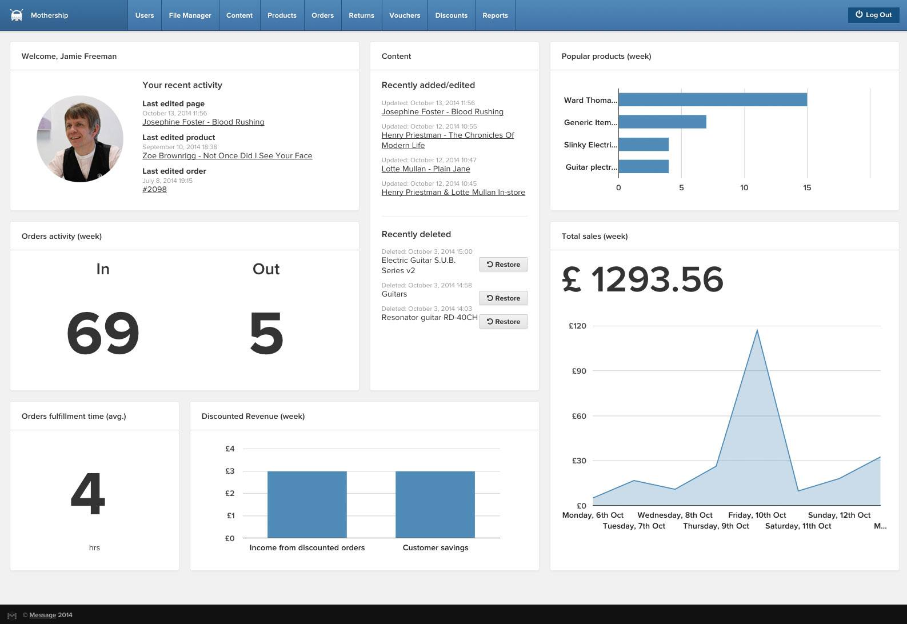

# Mothership: E-commerce for Humans

<a href="http://mothership.ec">Mothership</a> is open source web retail software, combining e-commerce with Electronic Point Of Sale (EPOS) into a single, unified platform. It is based on over 10 years experience, yet it is entirely new, containing zero legacy code, making it a perfect platform for developers.

It incorporates the full range of applications you'd expect to run an online store, with some rather nice surprises too. Here's an incomplete list of the headline functionality Mothership currently supports:

* CMS
* Inventory
* Shopping cart and checkout
* Stripe integration (with open architecture for other merchants)
* Excellent fulfilment process with printed documents and automated emails
* Returns
* Multiple currencies
* Multiple tax rates
* Gift vouchers
* Discount tokens
* Reports

## Coming soon!

* Electronic Point of Sale (EPOS)
* Xero online accounts integration
* Campaign Monitor mailing list integration

A comprehensive [Functionality Reference list](http://wiki.mothership.ec/Functionality_Reference) is available on the Mothership Wiki.

## System requirements

To set up <a href="http://mothership.ec">Mothership</a> using the installer, you must have the following:

+ **PHP** 5.4.0 or higher
	+ **PHP intl extention** (see <a href="http://php.net/manual/en/intl.setup.php">http://php.net/manual/en/intl.setup.php</a>)
+ **MySQL** 5.1.0 or higher
+ **Apache**
	+ **We cannot currently offer any guarantee that Mothership works with Nginx or other server software**
+ A **Unix-like** operating system (i.e. OSX, Linux, etc)
	+ Mothership **will not** work in a Windows environment at present
+ **Composer**
	+ Composer is a PHP dependency manager which can be downloaded from <a href="https://getcomposer.org/download/">the Composer website</a>. It handles the installation, updating and removal of Mothership modules.
	+ It is recommended that you install Composer globally

## Installation

There are two ways to install Mothership:

+ Using the automatic installer
+ Manually

### The installer

To install Mothership using the installer:

1. <a href="http://mothership.ec/files/downloads/mothership.phar">Download the installer</a>
1. Create an empty database
1. Run `php <path to>mothership.phar` in the terminal
1. Follow the instructions and answer the questions

### Manually

1. Run `composer create-project mothership-ec/mothership * <path to installation>`
1. Add your database details to `config/db.yml`
1. Run `bin/cog migrate:run` from the installation directory in the terminal
1. Run `bin/cog asset:dump` and `bin/cog asset:generate` from the installation directory in the terminal
1. Run `chmod -R 777 tmp public logs data` from the installation directory in the terminal
1. Run `bin/cog task:run user:create_admin` in your terminal to create the first admin user

## Working on and contributing to this repository

To set up an environment to develop on this repository

1. Clone the repo and install the dependencies using Composer
1. Edit the config files to describe your environment (be sure not to commit any of these config files)
1. Follow instructions from **3.** onwards from the manual install guide above
